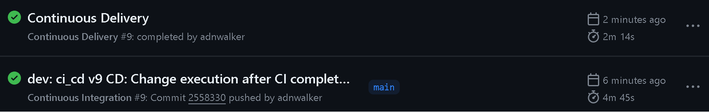

The project was developed according to Gitflow development practices, so I set these branches:

- main: master branch
- develop: develop branch to make tests and integrate features
- feature-model: develop branch focused on get a productive model
- feature-api: develop branch focused on get the model deployed with FAST API
- feaure-gcp: develop branch focused on get the API deployed in GCP

According to this, the time line was:

**[develop]**

- dev: exploration.ipynb revision and reports fixes. SNR (reports execution didnt work, barplot function with x,y parameters)
- dev: model selection. SNR

**[feature-model]**

- ft-model: tests passed, model saved. SNR

**[feature-api]**

- ft-api: tests passed, model saved. SNR
  The version to make the API worked was fastapi==0.69.0 |-| anyio

**[develop]**
merge feature-model
merge feature-api

- dev: model and api tests passed, ft-model and ft-api merged. SNR

**[feature-gcp]**

- ft-gcp: tests passed, api stress and predictions OK. SNR

**[develop]**
merge feature-gcp

- dev: model, api, api-stress tests passed \_ ft-model, ft-api, ft-gcp merged. SNR

**[develop]**

- dev: ci_cd v1. SNR -> Include ci and cd .yml files
  After multiple versions fixing de CI/CD workflow the last version is:
- dev: ci_cd v8 CD: Update GCloud SDK. SNR

**[main]**
merge develop
push main

**WORKFLOWS EXECUTION:**

CI/CD: allows on writing code (new changes) while ensuring that the application is tested and deployed seamlessly

Author: Santiago Narváez Romero (SNR)
